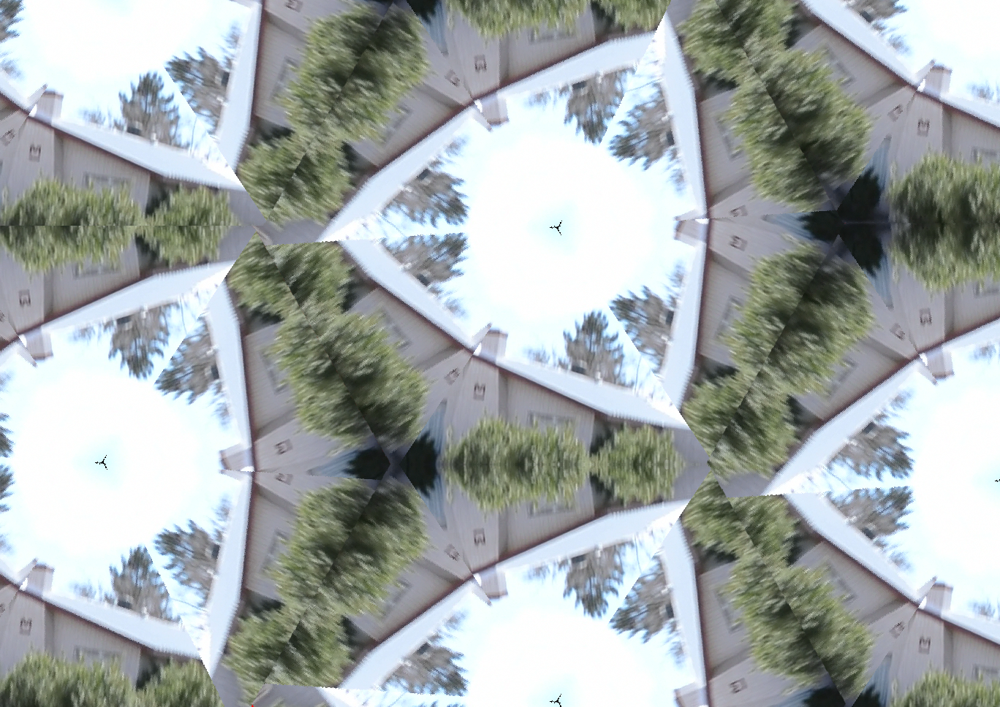

<h1>Requires Pillow and SimpleCV</h1>

<h3>Setting up for processing:</h3>
git clone to somewhere convenient
Copy your video into the Kaleidoscope/source directory

<h3>Convert Video to frames:</h3>
open up the notebook, import Pillow and SimpleCV,
in the next cell change the video source to your own video, then execute the cell.
This sets up a videocapture and display instances and then iterates through the source
saving each frame to the input directory.

<h3>Applying the Effects:</h3>
The next cell down includes all of the filters that will be applied to each frame, execute 
the cell to load them into the namespace. Finally execute the last cell which includes the 
main work loop, it takes each image and does the following
<ol>
<li>
<h5>Crops the image into a square</h5>
</li><li>
<h5>Creates an equalateral triangle</h5>
</li><li>
<h5>Mirrors and filps the triangle into a hexagon</h5>
</li><li>
<h5>Mirrors and filps the hexagon around the canvas</h5>
</li><li>
<h5>Saves image to Kaleidoscope/output</h5>
</li>
</ol>

<h3>Example Output</h3>

It's up to you to stitch the images back together, I have no experience with ffmpeg so I opted for
Quicktime Pro 7 (not bundled in OS X) then opened Kaleidoscope/output as an image sequence
